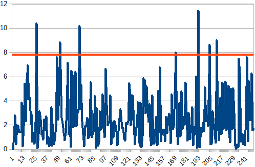
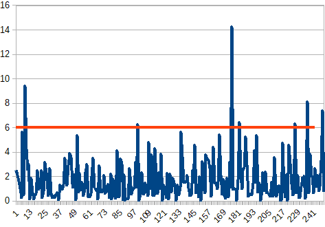

# Unscented Kalman Filter Project
Self-Driving Car Engineer Nanodegree Program

This is my (Anton Varfolomeev) implmentation of the UKF project - second
project of the second term of the SDC nano-degree.

To store and analyse NIS values, I used two log files.

Resulted graphs you can see below:

NIS for the radar measurements:

NIS for the laser measurements:

